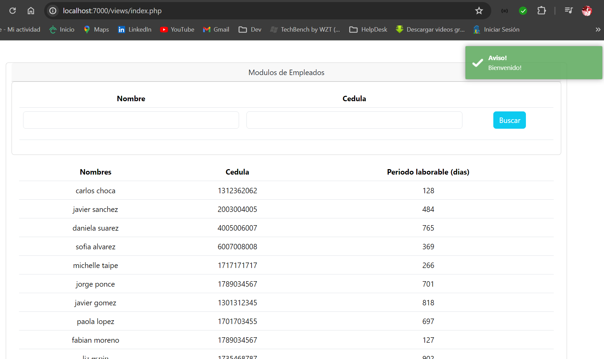
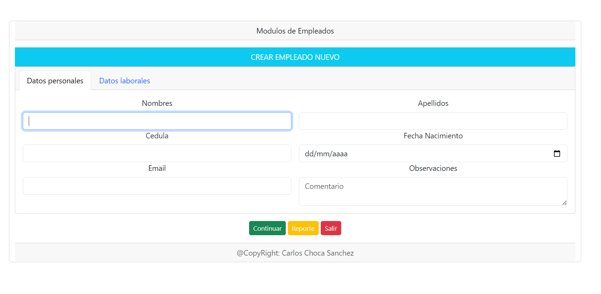

# Prueba de Challenge de programación.

## Provedatos

Computer Version:

[](https://www.microsoft.com/es-es/windows/windows-11?r=1)
[](https://ubuntu.com/)
[](https://www.apple.com/la/mac/)

> <strong> Este ejemplo ha sido desarrollado en PHP - JAVASCRIPT</strong>





[](https://www.php.net/)
[](https://www.javascript.com/)
[](https://www.mysql.com/)
[](https://getbootstrap.com/)
[](https://github.com/)
[](https://git-scm.com/)
[](https://www.linux.org/)
[](https://www.microsoft.com/es-es/windows/windows-11?r=1)
[](https://code.visualstudio.com/)

## 💻 Pre requirementos


Debe tener instalado los siguientes requisitos.

- Tener un servidor local (Xampp, Lamp o Laragon).
- Debe tener la version minimo de PHP 7.4 y MYSQL 5.7.

## 📫 Iniciar el proyecto


Al iniciar el proyecto, usted debe ejecutar el script de la base de datos, que se encuentra en la ruta del proyecto, esto lo debe ejecutar en su servidor local MYSQL:

1. Importar el script que esta en la ubicacion del proyecto:
   > data/scriptcompleto.sql


2. Usted debe realizar el cambio de la cadena de conexion en la ruta:

   > config/connection.config.php

   ```
   public $host = 'localhost';
   public $dbname = 'db_empleados';
   public $port = "3306";
   public $user = 'root';
   public $password = '';
   public $driver = 'mysql';
   ```

## 🚀 Iniciar el servidor de php:

Usted puede iniciar el servicio de php por localhost o por una servidor local especifico.

- Si usted elige una ruta especifica, puede iniciar en un terminal o linea de comando desde la raiz del proyecto y escribir: php -S 127.0.0.1:7000
  > [http:/127.0.0.1:7000](http://127.0.0.1:7000)

<div align="center">

### Realizado por:


## Carlos Choca Sanchez
